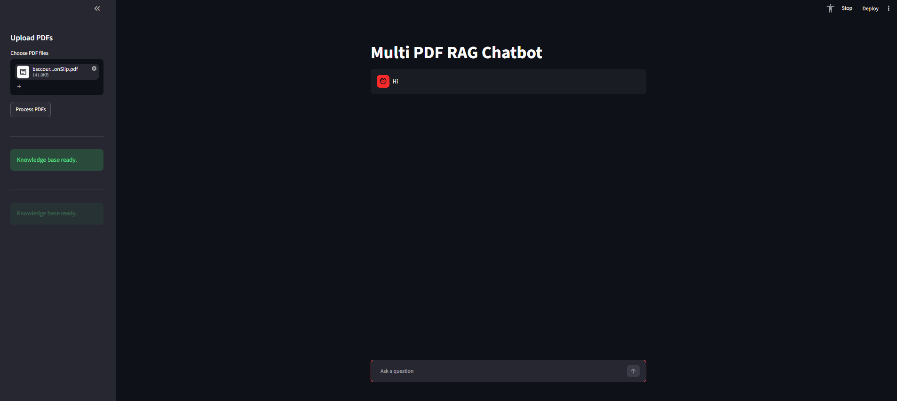

# 📚 Multi PDF RAG Chatbot

A Retrieval-Augmented Generation (RAG) chatbot that allows users to upload multiple PDF documents and ask questions about their content using natural language.

The application uses LangChain, FAISS, Google Gemini embeddings, and Streamlit to provide a conversational interface with source citations and history-aware retrieval.

---

## 📸 Screenshots

## Streamlit Application



---

## 🎈 Streamlit APP

[](https://your-app-name.streamlit.app)

---

## 🚀 Features

* Upload multiple PDF documents.
* Automatic text chunking.
* Vector embeddings using Gemini embeddings.
* FAISS vector database for semantic search.
* History-aware retrieval.
* Query rewriting for follow-up questions.
* Streaming responses.
* Source citations with page numbers.
* Session-based chat memory.
* Streamlit chat interface.
* Support for multiple document uploads.

---

## 🏗️ Architecture

User Question
↓
Query Rewriting
↓
Vector Retrieval (FAISS)
↓
Relevant Chunks
↓
LLM Generation
↓
Streaming Response
↓
Source Citation

---

## 🛠️ Tech Stack

* Python
* Streamlit
* LangChain
* FAISS
* Google Gemini API
* PyPDFLoader
* RecursiveCharacterTextSplitter

---

## 📂 Project Structure

```text
multi_pdf_rag_chatbot/
│
├── app.py
├── rag.py
├── requirements.txt
├── .env
├── temp/
├── img.png
└── README.md
```

---

## ⚙️ Installation

Clone the repository:

```bash
git clone https://github.com/yourusername/multi-pdf-rag-chatbot.git

cd multi-pdf-rag-chatbot
```

Create a virtual environment:

```bash
python -m venv myenv
```

Activate the environment:

Windows:

```bash
myenv\Scripts\activate
```

Linux/Mac:

```bash
source myenv/bin/activate
```

Install dependencies:

```bash
pip install -r requirements.txt
```

---

## 🔑 Environment Variables

Create a `.env` file:

```env
GOOGLE_API_KEY=your_api_key_here
```

---

## ▶️ Running the Application

```bash
streamlit run app.py
```

The application will open in your browser:

```text
http://localhost:8501
```

---

## 💬 How It Works

1. Upload one or more PDF files.
2. Click **Process PDFs**.
3. Documents are split into chunks.
4. Chunks are converted into embeddings.
5. FAISS stores the embeddings.
6. User questions are rewritten using conversation history.
7. Relevant chunks are retrieved.
8. Gemini generates the answer.
9. Sources are displayed with page numbers.

---

## 📖 Example

**Question:**

```text
What is a Python function?
```

**Response:**

```text
A Python function is a reusable block of code that performs a specific task.
```

**Sources:**

```text
python.pdf (Page 12)
```

---

## 🔮 Future Improvements

* Persistent FAISS storage.
* Chat history export.
* Docker support.
* Cloud deployment.
* Authentication.
* Hybrid search.
* Re-ranking.
* Citation highlighting.
* PDF preview.

---

## 🤝 Contributing

Contributions are welcome.

1. Fork the repository.
2. Create a feature branch.
3. Commit your changes.
4. Open a pull request.

---

## 👨‍💻 Author

Sagar Singh

If you found this project useful, consider giving it a ⭐ on GitHub.
